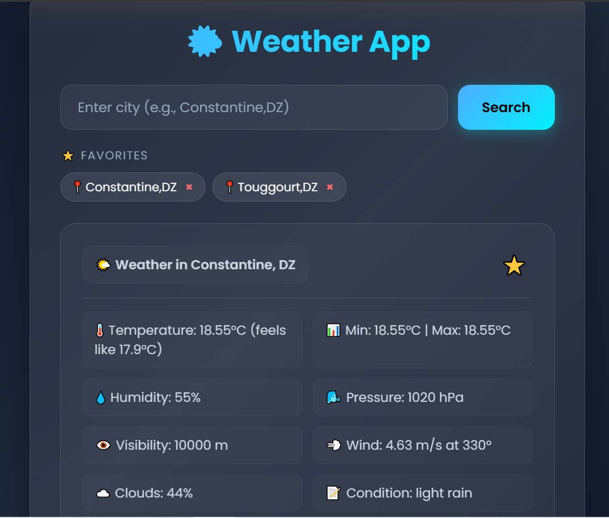

# 🌤️ Weather App


A simple weather web app built with Python, Flask, and OpenWeatherMap API.

## Features

- 🔍 Search weather by city name
- 🌍 Arabic & English support
- ⚠️ Error handling (city not found, no internet, API errors)
- 🎨 Modern UI
- ⭐ Favorites (saved in browser)

## Tech Stack

- **Python 3.11** + **Flask**
- **requests** + **python-dotenv**
- **OpenWeatherMap API**
- **HTML/CSS/JS**

## Setup

1. Clone the repo:
   ```bash
   git clone https://github.com/ahmedbougy/weather-app.git
   cd weather-app
Install dependencies:

bash
pip install -r requirements.txt
Create .env file:

text
OPENWEATHER_API_KEY=your_api_key_here
Run:

bash
python app.py
Open http://localhost:5000

Credits
Python logic & API integration: Ahmed Bougy

HTML/CSS/JS template: assisted by Gemini AI